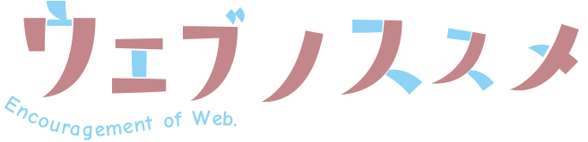

<!-- classes: title -->

# 

---

# 誰

やぎちゃんです

---

# Web はいいぞ

---

# なにがいいの ?

---

## Web のここが ~~いい~~ 好き

世間一般で言われているメリットではなく、個人的に好きなところ

- 手軽にアクセスできる
- 多機能、高表現力
- オープン
- 後方互換性

---

## 手軽に使える

- 様々な OS / UI 環境で利用可能 
  ブラウザが動けば OK
- インストール不要 
  URL 打って **ッターン** で OK!
- [オフラインで大丈夫](https://www.youtube.com/watch?v=36FeSCWVjpM) 
  急な回線落ちにも安心！
- 様々な人から使いやすい 
  (ちゃんと作れば) アクセシビリティが担保される

---

## 多機能、高表現力

本来の目的である情報の検索と閲覧、通信はもちろん……

- 複雑 GUI やアニメーション
- センサーや外部デバイスの操作
- 他の言語のライブラリも

---

## オープン

Web を作るのは自分たち

- 仕様はで非営利団体が策定、GitHub で公開
- Extensible Web

---

## 後方互換性

- Web 標準の中ではでは急に Web ページが壊れない
- [最初の Web ページ](http://info.cern.ch/hypertext/WWW/TheProject.html) が最新のブラウザで表示される！

---

# でも

---

## いいところは守らないと無くなってしまう

- 手軽にアクセスできる（ように作らなければいけない）
- 多機能、高表現力（キャッチアップが大変）
- オープン（Contribute!）
- 後方互換性（ライブラリやツールの進化は速い）

<!-- fragments-start -->

→ 大切にしていること

<!-- fragments-end -->

---

# Web やらない？

---

# Web やろう

---

# ところで

---

## あなたの「○○ はいいぞ」が聞きたいです！

○○ = ゲーム、DTM、VR、言語、人工知能、電子工作などなど

---

## 作ってて感じた「○○ はいいぞ」のいいところ

- 布教すると楽しい
- 知らなかったことが知れる（といいなあ）
- 好きなものの好きなところを **言語化** するのは大切
- 何かはじめたい人の参考になるかも

---

# まとめ

- Web はいいぞ
- 「○○ はいいぞ」待ってます
